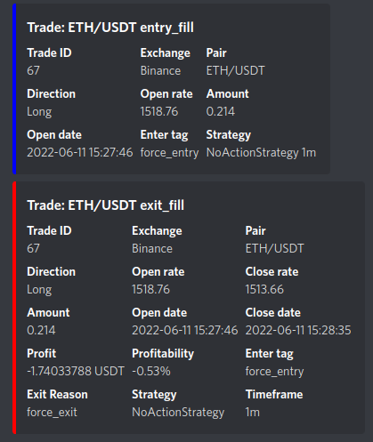

# Webhook usage

Xplitrade has two independent webhook systems:

- **Outgoing webhooks** — Xplitrade sends notifications to an external URL (Discord, IFTTT, your own server) when trades open, close, or status changes.
- **Incoming signal webhook** — External sources send a POST request to Xplitrade to trigger a trade. [Jump to incoming signal webhook →](#incoming-signal-webhook)

---

## Outgoing webhooks

### Configuration

Enable webhooks by adding a webhook-section to your configuration file, and setting `webhook.enabled` to `true`.

Sample configuration (tested using IFTTT).

```json
  "webhook": {
        "enabled": true,
        "url": "https://maker.ifttt.com/trigger/<YOUREVENT>/with/key/<YOURKEY>/",
        "entry": {
            "value1": "Buying {pair}",
            "value2": "limit {limit:8f}",
            "value3": "{stake_amount:8f} {stake_currency}"
        },
        "entry_cancel": {
            "value1": "Cancelling Open Buy Order for {pair}",
            "value2": "limit {limit:8f}",
            "value3": "{stake_amount:8f} {stake_currency}"
        },
         "entry_fill": {
            "value1": "Buy Order for {pair} filled",
            "value2": "at {open_rate:8f}",
            "value3": ""
        },
        "exit": {
            "value1": "Exiting {pair}",
            "value2": "limit {limit:8f}",
            "value3": "profit: {profit_amount:8f} {stake_currency} ({profit_ratio})"
        },
        "exit_cancel": {
            "value1": "Cancelling Open Exit Order for {pair}",
            "value2": "limit {limit:8f}",
            "value3": "profit: {profit_amount:8f} {stake_currency} ({profit_ratio})"
        },
        "exit_fill": {
            "value1": "Exit Order for {pair} filled",
            "value2": "at {close_rate:8f}.",
            "value3": ""
        },
        "status": {
            "value1": "Status: {status}",
            "value2": "",
            "value3": ""
        }
    },
```

The url in `webhook.url` should point to the correct url for your webhook. If you're using [IFTTT](https://ifttt.com) (as shown in the sample above) please insert your event and key to the url.

You can set the POST body format to Form-Encoded (default), JSON-Encoded, or raw data. Use `"format": "form"`, `"format": "json"`, or `"format": "raw"` respectively. Example configuration for Mattermost Cloud integration:

```json
  "webhook": {
        "enabled": true,
        "url": "https://<YOURSUBDOMAIN>.cloud.mattermost.com/hooks/<YOURHOOK>",
        "format": "json",
        "status": {
            "text": "Status: {status}"
        }
    },
```

The result would be a POST request with e.g. `{"text":"Status: running"}` body and `Content-Type: application/json` header which results `Status: running` message in the Mattermost channel.

When using the Form-Encoded or JSON-Encoded configuration you can configure any number of payload values, and both the key and value will be output in the POST request. However, when using the raw data format you can only configure one value and it **must** be named `"data"`. In this instance the data key will not be output in the POST request, only the value. For example:

```json
  "webhook": {
        "enabled": true,
        "url": "https://<YOURHOOKURL>",
        "format": "raw",
        "webhookstatus": {
            "data": "Status: {status}"
        }
    },
```

The result would be a POST request with e.g. `Status: running` body and `Content-Type: text/plain` header.

### Nested Webhook Configuration

Some webhook targets require a nested structure.
This can be accomplished by setting the content as dictionary or list instead of as text directly.  

This is only supported for the JSON format.

```json
"webhook": {
    "enabled": true,
    "url": "https://<yourhookurl>",
    "format": "json",
    "status": {
        "msgtype": "text",
        "text": {
            "content": "Status update: {status}"
        }
    }
}
```

The result would be a POST request with e.g. `{"msgtype":"text","text":{"content":"Status update: running"}}` body and `Content-Type: application/json` header.

## Additional configurations

The `webhook.retries` parameter can be set for the maximum number of retries the webhook request should attempt if it is unsuccessful (i.e. HTTP response status is not 200). By default this is set to `0` which is disabled. An additional `webhook.retry_delay` parameter can be set to specify the time in seconds between retry attempts. By default this is set to `0.1` (i.e. 100ms). Note that increasing the number of retries or retry delay may slow down the trader if there are connectivity issues with the webhook.
You can also specify `webhook.timeout` - which defines how long the bot will wait until it assumes the other host as unresponsive (defaults to 10s).

Example configuration for retries:

```json
  "webhook": {
        "enabled": true,
        "url": "https://<YOURHOOKURL>",
        "timeout": 10,
        "retries": 3,
        "retry_delay": 0.2,
        "status": {
            "status": "Status: {status}"
        }
    },
```

Custom messages can be sent to Webhook endpoints via the `self.dp.send_msg()` function from within the strategy. To enable this, set the `allow_custom_messages` option to `true`:

```json
  "webhook": {
        "enabled": true,
        "url": "https://<YOURHOOKURL>",
        "allow_custom_messages": true,
        "strategy_msg": {
            "status": "StrategyMessage: {msg}"
        }
    },
```

Different payloads can be configured for different events. Not all fields are necessary, but you should configure at least one of the dicts, otherwise the webhook will never be called.

## Webhook Message types

### Entry / Entry fill

The fields in `webhook.entry` and `webhook.entry_fill` are filled when the bot places a long/short Order to increase a position, or when that order fills respectively. Parameters are filled using string.format.
Possible parameters are:

* `trade_id`
* `exchange`
* `pair`
* `direction`
* `leverage`
* ~~`limit` # Deprecated - should no longer be used.~~
* `open_rate`
* `amount`
* `open_date`
* `stake_amount`
* `stake_currency`
* `base_currency`
* `quote_currency`
* `fiat_currency`
* `order_type`
* `current_rate`
* `enter_tag`

### Entry cancel

The fields in `webhook.entry_cancel` are filled when the bot cancels a long/short order. Parameters are filled using string.format.
Possible parameters are:

* `trade_id`
* `exchange`
* `pair`
* `direction`
* `leverage`
* `limit`
* `amount`
* `open_date`
* `stake_amount`
* `stake_currency`
* `base_currency`
* `quote_currency`
* `fiat_currency`
* `order_type`
* `current_rate`
* `enter_tag`

### Exit / Exit fill

The fields in `webhook.exit` and `webhook.exit_fill` are filled when the bot places an exit order, or when that exit order fills respectively. Parameters are filled using string.format.
Possible parameters are:

* `trade_id`
* `exchange`
* `pair`
* `direction`
* `leverage`
* `gain`
* `amount`
* `open_rate`
* `close_rate`
* `current_rate`
* `profit_amount`
* `profit_ratio`
* `stake_currency`
* `base_currency`
* `quote_currency`
* `fiat_currency`
* `enter_tag`
* `exit_reason`
* `order_type`
* `open_date`
* `close_date`
* `sub_trade`
* `is_final_exit`


### Exit cancel

The fields in `webhook.exit_cancel` are filled when the bot cancels a exit order. Parameters are filled using string.format.
Possible parameters are:

* `trade_id`
* `exchange`
* `pair`
* `direction`
* `leverage`
* `gain`
* `order_rate`
* `amount`
* `open_rate`
* `current_rate`
* `profit_amount`
* `profit_ratio`
* `stake_currency`
* `base_currency`
* `quote_currency`
* `fiat_currency`
* `exit_reason`
* `order_type`
* `open_date`
* `close_date`

### Status

The fields in `webhook.status` are used for regular status messages (Started / Stopped / ...). Parameters are filled using string.format.

The only possible value here is `{status}`.

## Discord

A special form of webhooks is available for discord.
You can configure this as follows:

```json
"discord": {
    "enabled": true,
    "webhook_url": "https://discord.com/api/webhooks/<Your webhook URL ...>",
    "exit_fill": [
        {"Trade ID": "{trade_id}"},
        {"Exchange": "{exchange}"},
        {"Pair": "{pair}"},
        {"Direction": "{direction}"},
        {"Open rate": "{open_rate}"},
        {"Close rate": "{close_rate}"},
        {"Amount": "{amount}"},
        {"Open date": "{open_date:%Y-%m-%d %H:%M:%S}"},
        {"Close date": "{close_date:%Y-%m-%d %H:%M:%S}"},
        {"Profit": "{profit_amount} {stake_currency}"},
        {"Profitability": "{profit_ratio:.2%}"},
        {"Enter tag": "{enter_tag}"},
        {"Exit Reason": "{exit_reason}"},
        {"Strategy": "{strategy}"},
        {"Timeframe": "{timeframe}"},
    ],
    "entry_fill": [
        {"Trade ID": "{trade_id}"},
        {"Exchange": "{exchange}"},
        {"Pair": "{pair}"},
        {"Direction": "{direction}"},
        {"Open rate": "{open_rate}"},
        {"Amount": "{amount}"},
        {"Open date": "{open_date:%Y-%m-%d %H:%M:%S}"},
        {"Enter tag": "{enter_tag}"},
        {"Strategy": "{strategy} {timeframe}"},
    ]
}
```

The above represents the default (`exit_fill` and `entry_fill` are optional and will default to the above configuration) - modifications are obviously possible.
To disable either of the two default values (`entry_fill` / `exit_fill`), you can assign them an empty array (`exit_fill: []`).

Available fields correspond to the fields for webhooks and are documented in the corresponding webhook sections.

The notifications will look as follows by default.



Custom messages can be sent from a strategy to Discord endpoints via the dataprovider.send_msg() function. To enable this, set the `allow_custom_messages` option to `true`:

```json
  "discord": {
        "enabled": true,
        "webhook_url": "https://discord.com/api/webhooks/<Your webhook URL ...>",
        "allow_custom_messages": true,
    },
```

---

## Incoming Signal Webhook

Xplitrade has a built-in **incoming** signal endpoint. Any external source — your own scripts, a mobile app, an alert service — can POST a signal to trigger a buy, sell, or emergency exit without needing to authenticate with JWT.

### Enable in config.json

```json
"webhook_signal": {
    "enabled": true,
    "secret": "CHANGE_THIS_TO_A_RANDOM_SECRET"
}
```

!!! warning "Keep the secret safe"
    Choose a strong random string (32+ characters). Anyone who knows this secret can trigger trades on your bot.

### Endpoint

```
POST /api/v1/webhook/signal
```

**Required header:**

```
X-Xplitrade-Token: <your_secret>
```

### Actions

#### Buy (open a long position)

```json
{
    "action": "buy",
    "pair": "BTC/USDT",
    "stake_amount": 100,
    "tag": "my_signal"
}
```

#### Sell (close open position on a pair)

```json
{
    "action": "sell",
    "pair": "BTC/USDT"
}
```

#### Close all (emergency — exits every open trade)

```json
{
    "action": "close_all"
}
```

### Full payload reference

| Field | Type | Required | Description |
|---|---|---|---|
| `action` | `"buy"` \| `"sell"` \| `"close_all"` | Yes | What to do |
| `pair` | string e.g. `"BTC/USDT"` | For buy/sell | Trading pair |
| `stake_amount` | float | No | USDT amount (defaults to `stake_amount` in config) |
| `price` | float | No | Limit price — omit for market order |
| `tag` | string | No | Label shown in trade history and logs |

### Example — trigger from command line

```bash
curl -X POST http://YOUR_VPS_IP:8080/api/v1/webhook/signal \
  -H "Content-Type: application/json" \
  -H "X-Xplitrade-Token: CHANGE_THIS_TO_A_RANDOM_SECRET" \
  -d '{"action": "buy", "pair": "ETH/USDT", "tag": "manual_signal"}'
```

### Example — trigger from Python

```python
import requests

XPLITRADE_URL = "http://YOUR_VPS_IP:8080"
SECRET = "CHANGE_THIS_TO_A_RANDOM_SECRET"

def send_signal(action, pair=None, stake_amount=None, tag=None):
    payload = {"action": action}
    if pair:
        payload["pair"] = pair
    if stake_amount:
        payload["stake_amount"] = stake_amount
    if tag:
        payload["tag"] = tag

    resp = requests.post(
        f"{XPLITRADE_URL}/api/v1/webhook/signal",
        json=payload,
        headers={"X-Xplitrade-Token": SECRET},
    )
    return resp.json()

# Buy BTC
send_signal("buy", pair="BTC/USDT", stake_amount=100, tag="python_script")

# Close all positions (emergency)
send_signal("close_all")
```
